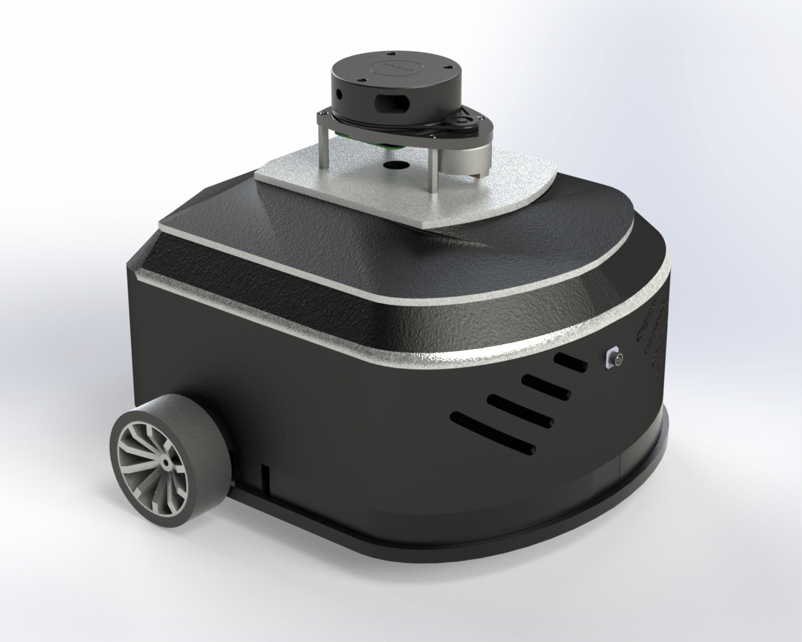
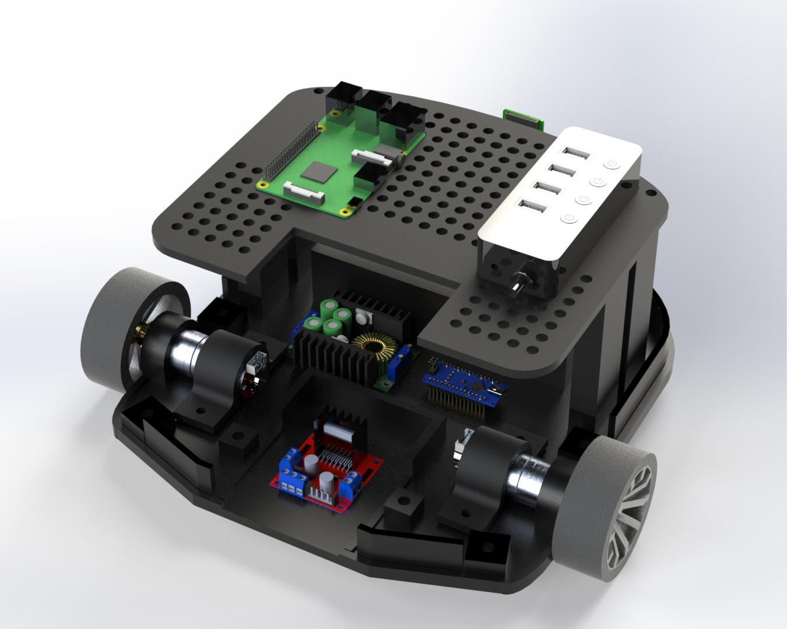

# DDR-SLAM: Simultaneous Localization and Mapping of Differential Drive Robots

## Introduction

DDR-SLAM is a ROS2-based project that implements Simultaneous Localization and Mapping (SLAM) for a differential drive robot. The project uses Gazebo Fortress as a simulation environment to test the SLAM algorithm.


## Installation

To use DDR-SLAM, you need to have ROS2 Humble and Gazebo Fortress installed on your system. You can follow the official ROS2 Humble installation guide [here](https://docs.ros.org/en/humble/Installation.html) and the Gazebo Fortress installation guide [here](https://gazebosim.org/docs/fortress/install).

Once you have ROS2 and Gazebo Fortress installed, create a ROS2 workspace, cd into it and clone the DDR-SLAM repository and build the project:

```
mkdir ros2_workspace
cd ros2_workspace
git clone https://github.com/mouaff25/DDR-SLAM.git
cd DDR-SLAM
git submodule init
git submodule update
cd ..
mv DDR-SLAM src
```

Now we need to install our package dependencies using rosdep.
If this is your first time using rosdep, it must be initialized via:
```
sudo rosdep init
rosdep update
```

Now run the following commands:
```
export IGNITION_VERSION=fortress
cd ~/ros2_workspace/src
rosdep install -r --from-paths . --ignore-src --rosdistro $ROS_DISTRO -y
cd ~/ros2_workspace
rosdep install --from-paths src -y --ignore-src
colcon build
```

If you encounter a controller_manager related error during building, execute the following command and retry building:
```
sudo apt install ros-humble-ros2-control ros-humble-ros2-controllers
colcon build
```

## Usage

To launch the DDR-SLAM simulation in the Gazebo Fortress environment, you can use the provided launch file:

```
source ~/ros2_workspace/install/local_setup.bash
ros2 launch ppp_bot launch_sim.launch.py
```

You can also specify the launch parameter world_name by choosing one of these four worlds:
| | |
|:-------------------------:|:-------------------------:|
|  cones |   room |
| room_with_cones |   maze |


The launch file will start Gazebo Fortress with a differential drive robot. You can then move the robot around in the environment and observe the SLAM output in RViz 2.

You can also launch the navigation node by opening another terminal and using the navigation.launch.py launch file:

```
source ~/ros2_workspace/install/local_setup.bash
ros2 launch ppp_bot navigation.launch.py use_sim_time:=true
```

## Results

Here are some sample results of DDR-SLAM running in the Gazebo Fortress environment:

| | |
|:-------------------------:|:-------------------------:|
|  Gazebo Ignition |   RViz 2 |

## Future Improvements

Future plans include:
1. Adding parameters to the xacro files used for robot description.
2. Implementing more sensors for a more accurate localization.
3. Implementing the algorithms on a robot and testing them in the real world.

Some steps have already been taken by making an initial design of our differential drive robot:

| | |
|:-------------------------:|:-------------------------:|
|  Front View |   Interior View |

For more information regarding the robot design, please contact:

Mohamed Yassine Nefzi ynyassine7@gmail.com

## Acknowledgements

This project was inspired by the [Building a mobile robot](https://www.youtube.com/watch?v=OWeLUSzxMsw&list=PLunhqkrRNRhYAffV8JDiFOatQXuU-NnxT&pp=iAQB) youtube playlist by [Articulated Robotics](https://www.youtube.com/@ArticulatedRobotics/featured).

I would also like to thank my teammates Mohamed Yassine Nefzi and Jawher Djebbi for their help and contribution to the project.

## License

DDR-SLAM is licensed under the MIT License. See the [LICENSE](LICENSE) file for details.

## Contact

For any questions or feedback, please contact the author:

Mouafak Dakhlaoui
mouaffak9@gmail.com
